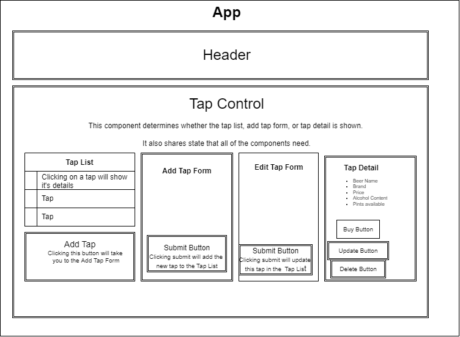

# Tap :beers: List :beers:

### Created by Christen Weston

#### Tap List project! Here you can view a list of available beers on tap, add taps, update taps, and delete taps!

## Technologies Used :woman_technologist:

* Git
* HTML
* CSS
* NPM
* Javascript
* React

## Setup Installation Requirements :scroll:

1. :white_medium_square:  Clone the Tap List repository
2. :white_medium_square:  Open in your favorite IDE
3. :white_medium_square:  Add additional beers to the **TapData.js** file*
4. :white_medium_square:  run `npm install`
5. :white_medium_square:  run `npm start`
6. :white_medium_square:  Enjoy! :partying_face:

# Known Bugs
None

## Date Published
>June 2022

## License Info
[MIT License](https://opensource.org/licenses/MIT)